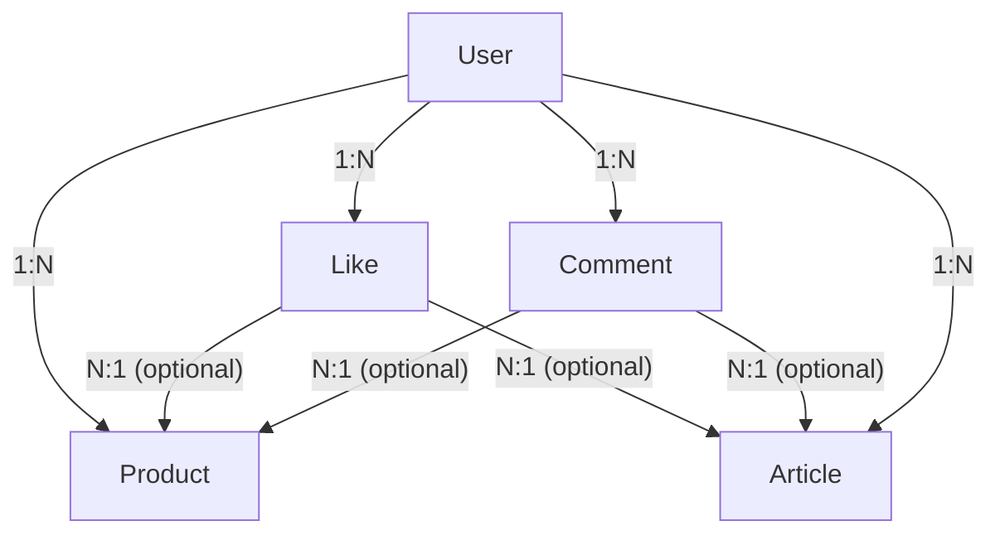

# 스프린트 미션4

- 기존 스프린트 미션3을 토대로 미션4를 진행하고자 했으나 스키마 프리즈마의 관계 설정, 기존 모델과 추가될 모델 간의 구조적 간극을 좁히지 못하고 미션3의 모범답안을 참조하여 작성되었음을 명시합니다.

## 추가된 주요 기능

- 유저 모델 추가
- 좋아요 모델 추가
- 인증 / 인가
- 회원가입
- 로그인 / 로그아웃
- 프로필 조회
- 프로필 수정(이미지, 닉네임, 이메일)
- 비밀번호 변경
- 좋아요 / 좋아요 취소
- 좋아요 여부 isLiked 포함 응답
- 내가 작성한 상품 목록 페이지네이션
- 내가 좋아요한 상품 목록 페이지네이션

## ERD 다이어그램



- 한 유저는 같은 Product/Article 에 한 번만 좋아요를 누를 수 있습니다. (unique 제약)

## 프로젝트 구조

```
mission4
├── middlewares
│   └── authenticate.js
│
├── prisma
│   ├── migrations
│   └── schema.prisma
│
├── src
│   ├── controllers
│   │   ├── articlesController.js
│   │   ├── commentsController.js
│   │   ├── errorController.js
│   │   ├── imagesController.js
│   │   ├── productsController.js
│   │   └── usersController.js
│   │
│   ├── lib
│   │   ├── constants.js
│   │   ├── cookies.js
│   │   ├── errors
│   │   │   └── customErrors.js
│   │   ├── prismaClient.js
│   │   ├── token.js
│   │   └── withAsync.js
│   │
│   ├── routers
│   │   ├── articlesRouter.js
│   │   ├── commentsRouter.js
│   │   ├── imagesRouter.js
│   │   ├── productsRouter.js
│   │   └── usersRouter.js
│   │
│   ├── structs
│   │   ├── articlesStructs.js
│   │   ├── commentsStructs.js
│   │   ├── commonStructs.js
│   │   ├── productsStructs.js
│   │   └── usersStructs.js
│   │
│   └── main.js
│
├── tests
│   ├── test.http
│   ├── test.js
│   └── test.png
│
├── package.json
├── package-lock.json
└── readme.md
```
