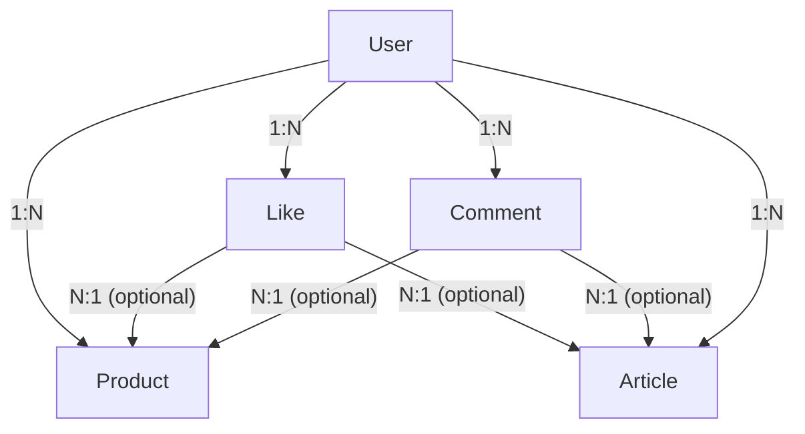

# 스프린트 미션5

- 미션4 js -> ts전환, 레이어드 아키텍처 적용

## 추가된 주요 기능

- repository 추가
- service 추가
- type 및 dto 추가

## ERD 다이어그램



- 한 유저는 같은 Product/Article 에 한 번만 좋아요를 누를 수 있습니다. (unique 제약)

## 프로젝트 구조

```
mission5
├── dist
├── prisma
│   ├── migrations
│   └── schema.prisma
├── public
│
├── src
│   ├── controllers
│   │   ├── articlesController.ts
│   │   ├── commentsController.ts
│   │   ├── errorController.ts
│   │   ├── imagesController.ts
│   │   ├── productsController.ts
│   │   └── usersController.ts
│   │
│   ├── lib
│   │   ├── errors
│   │   │   ├── customErrors.ts
│   │   │   └── errorUtils.ts
│   │   ├── constants.ts
│   │   ├── cookies.ts
│   │   ├── prismaClient.ts
│   │   ├── token.ts
│   │   └── withAsync.ts
│   │
│   ├── middlewares
│   │   └── authenticate.ts
│   │
│   ├── repositories
│   │   ├── articleRepository.ts
│   │   ├── commentRepository.ts
│   │   ├── likeRepository.ts
│   │   ├── productRepository.ts
│   │   └── userRepository.ts
│   │
│   ├── routers
│   │   ├── articlesRouter.ts
│   │   ├── commentsRouter.ts
│   │   ├── imagesRouter.ts
│   │   ├── productsRouter.ts
│   │   └── usersRouter.ts
│   │
│   ├── services
│   │   ├── articleService.ts
│   │   ├── commentService.ts
│   │   ├── imageService.ts
│   │   ├── productService.ts
│   │   └── userService.ts
│   │
│   ├── structs
│   │   ├── articlesStructs.ts
│   │   ├── commentsStructs.ts
│   │   ├── commonStructs.ts
│   │   ├── productsStructs.ts
│   │   └── usersStructs.ts
│   │
│   └── main.ts
│
├── tests
├── types
├── package.json
├── package-lock.json
└── readme.md
```
